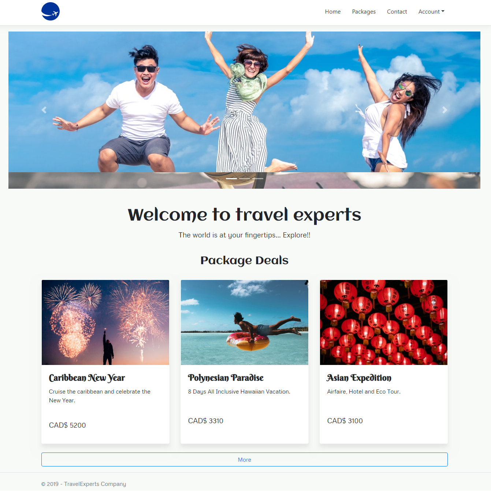
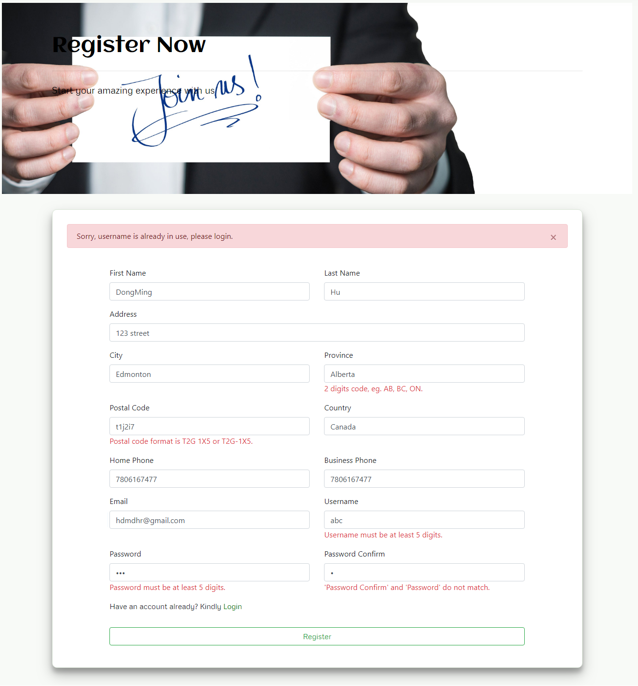
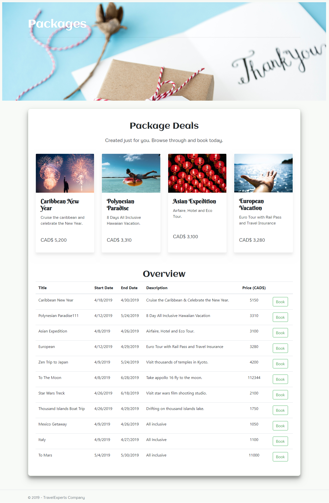
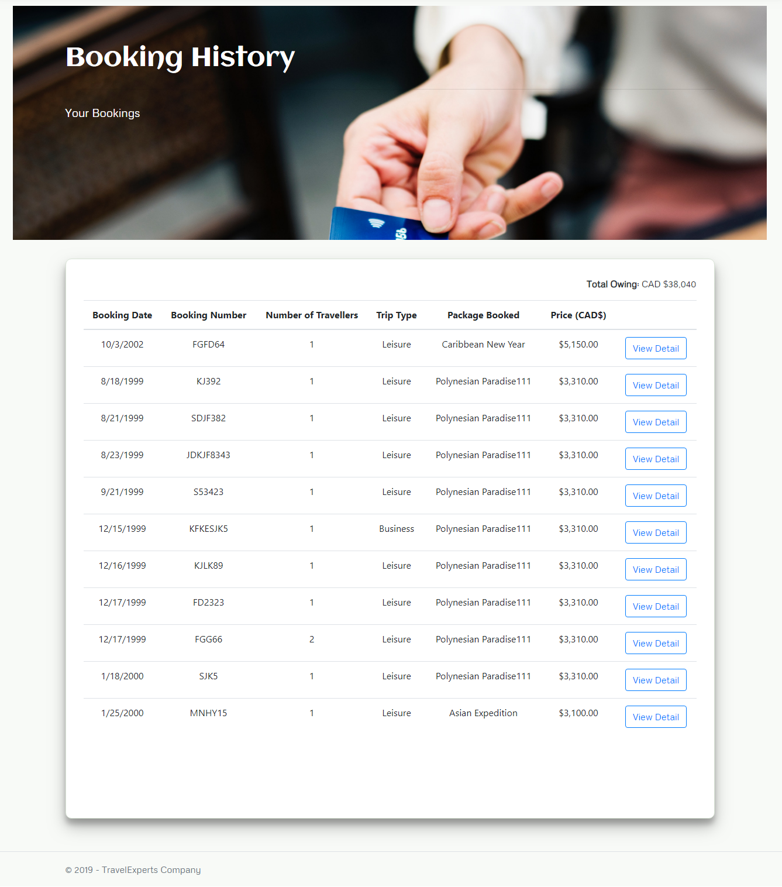
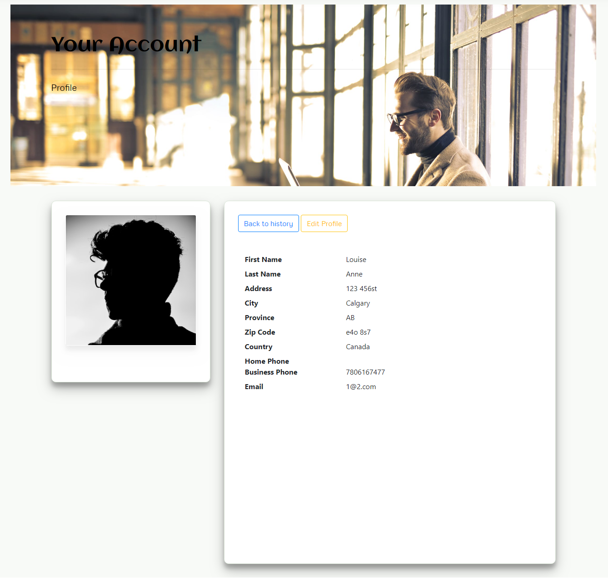

# Travel-Agency-Web-App

## App Overview
* Web application of a travel agency, mainly for customer usage. 
* Created with ASP.NET Core framework, team project at SAIT.
<br>
<kbd>
  
</kbd>
<br>

## Twin Product - Data Management App
[**Travel Agency Desktop App**](https://github.com/hdmdhr/Travel-Agency-Desktop-App)

## Requirements to run
To test the app, please install Microsoft Visual Studio 2017, SQL Server, and add database by running sql script under repository root directory.
```
Travel-Agency-Web-App\travelexperts-mssql.sql
```

## Functions

### Register and Login
Validate user input when doing registration.
</img>
<br>

### View and Book Travel Packages
Featured packages on top and overview below.
</img>
<br>


### View Booking History and Profile
After user logged in, they can view their booking history and edit profile.
</img>
</img>

## Built With
* IDE - *Microsoft Visual Studio Enterprise 2017*
* Database - *SQL Server*
* Language - *C#*
* Frameworks - *ASP.NET Core MVC, EntityFramework*

## Author
* **DongMing Hu** - [hdmdhr](https://github.com/hdmdhr)
* **Louise Acosta** - [louiseanacosta](https://github.com/louiseanacosta)
* **Ibraheem** - [kabaltech](https://github.com/kabaltech)
